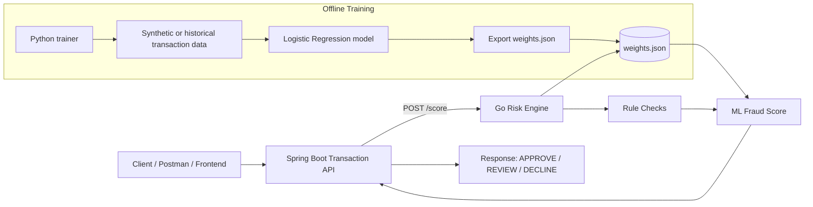

# AI-Powered Fraud Detection Platform


## Problem Statement

We need to build a real-time fraud detection system that evaluates payment transactions and returns a decision quickly enough to sit in the transaction path.

## Requirements
The system should:
- Accept a transaction request
- Score fraud risk in real time
- Return APPROVE, REVIEW, or DECLINE
- Provide basic explainability for the decision
- Be designed so it can scale and evolve into a production fraud platform

## Technology Stack
Built with:

- **Spring Boot** for the transaction API
- **Go** for low-latency fraud scoring
- **Python** for ML training and weight export
- **Docker Compose** for local orchestration

## Architecture




## Run locally without Docker

### 1. Start Go risk engine
```bash
cd go-risk-engine
go run ./cmd/server
```

### 2. Start Spring Boot API
```bash
cd springboot-api
mvn spring-boot:run
```

### 3. Call the API
```bash
curl -X POST http://localhost:8080/api/v1/fraud/score \
  -H 'Content-Type: application/json' \
  -d '{
    "transactionId":"txn-risky-2001",
    "amount":3200,
    "currency":"USD",
    "country":"NG",
    "deviceTrusted":false,
    "international":true,
    "hourOfDay":2,
    "accountAgeDays":12,
    "transactionsLastHour":11,
    "emailAgeDays":5
  }'
```

## Run with Docker
```bash
docker compose up --build
```

Then test:
```bash
curl -X POST http://localhost:8080/api/v1/fraud/score \
  -H 'Content-Type: application/json' \
  -d '{
    "transactionId":"txn-1001",
    "amount":2500,
    "currency":"USD",
    "country":"US",
    "deviceTrusted":false,
    "international":true,
    "hourOfDay":1,
    "accountAgeDays":9,
    "transactionsLastHour":8,
    "emailAgeDays":3
  }'
```

## Sequence Diagram


## Phase 2 additions
- Kafka transaction ingestion
- PostgreSQL fraud audit history
- Redis velocity and device checks
- Swagger/OpenAPI docs
- Prometheus + Grafana metrics
- Kubernetes manifests
